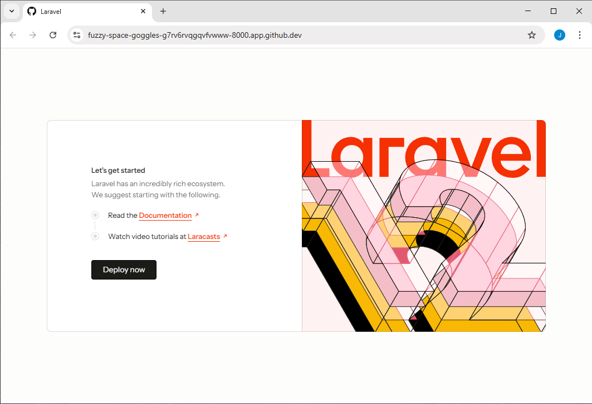

# Laravel Template for GitHub Codespaces



A ready-to-use Laravel development environment, optimized for GitHub Codespaces.
This template provides a seamless, zero-setup experience for Laravel development
in the cloud.

## Dev Container Config Overview

- **Pre-configured Dev Container**: Uses Docker Compose to orchestrate PHP 8.2
  (LTS), Node.js 18 (LTS), and MySQL 8.0 (LTS) services.
- **MySQL Pre-installed and Running**: MySQL 8.0 is included as a service in the
  dev container—no need to install or configure a database server manually.
- **VS Code Extensions**: Installs recommended extensions for Laravel, PHP, and
  Docker development.
- **Automated Setup**: Handles dependency installation, environment setup, and
  database migrations automatically on first launch.
- **Correct Permissions**: Ensures storage and cache directories are writable for
  Laravel.

## Laravel Standard Installation

- **Laravel Version**: 12.19.3 (latest as of July 2025)
- **Standard Structure**: Includes all default Laravel directories and files
  (`app/`, `config/`, `database/`, `routes/`, etc.)
- **No Custom Packages**: Clean install, ready for your customization.

## Out-of-the-Box Features

- **Automated Dependency Installation**: Runs `composer install` and
  `npm install` on first start.
- **Automatic `.env` Setup**: Copies `.env.example` to `.env` and configures
  database credentials for the Codespace environment.
- **Database Prepared Automatically**: The MySQL database is created, ready, and
  all migrations are run for you—no manual steps needed.
- **Pre-installed VS Code Extensions**: Includes extensions for Blade, PHP
  Intelephense, Laravel snippets, and more.
- **Writable Storage/Cache**: Ensures `storage/` and `bootstrap/cache/` are
  writable by the application.

## Getting Started in Codespaces

1. You can get started with this template in several ways:
    - **Open a Codespace directly from GitHub:**
      - If this repository is public, you can click the "Code" button on the
        repo page and select "Create codespace on main" (or another branch).
        No need to fork or clone first — GitHub will automatically provision a
        Codespace with the repo contents and devcontainer setup.
    - **Fork the repository:**
      - If you want your own copy of the repository (for making changes or
        keeping your own Codespace), fork it on GitHub, then open a Codespace
        from your fork.
    - **Manual setup using the devcontainer:**
      - You may also copy the `.devcontainer` folder/configuration to another
        project or environment to reuse the same development setup. This is
        only recommended if you know what you are doing — your project may not
        work at all if the environment is not compatible or is missing
        required services.

2. **Wait for Setup**: The container will build, dependencies will be installed,
   and the database will be prepared automatically. As soon as the Codespace is
   available, you can open the `setup-status.log` file in the project root to
   watch the automated setup progress and verify it completed successfully.
3. **Start the Laravel Development Server**: Run the following command in the
   terminal to start the app and make it accessible:

   ```bash
   php artisan serve --host=0.0.0.0 --port=8000
   ```
4. **Open in Browser**: Once the app is running, a pop-up may appear in
   Codespaces with an "Open in Browser" button for port 8000. If you miss it,
   you can always go to the "Ports" tab, find port 8000, and click "Open in
   Browser". (The URL will be a Codespaces-specific address, not localhost.)

## License

This template is provided under the MIT License. See [LICENSE](LICENSE) for
full details.
